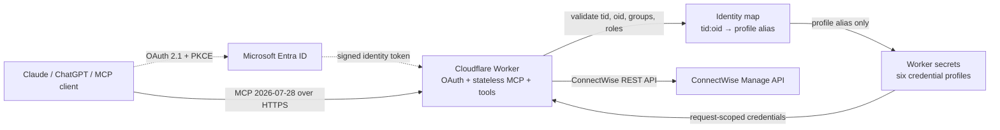

# ConnectWise MCP v2 Architecture

> **Status:** Worker V2 security/authentication is implemented in `src/`, including `whoami` and one narrow request-scoped read-only `get_service_ticket` tool that returns only ticket ID and status metadata. Additional reads, all writes, and live staging validation remain gated. The existing Docker deployment stays available for rollback until the required acceptance gates pass.

## Recommendation

Evolve this repository in place. Implement the new architecture on a feature branch, preserve the existing Docker deployment during migration, and merge only after the Cloudflare-native server reaches functional parity.

The target is a single stateless TypeScript Cloudflare Worker implementing the MCP 2026-07-28 protocol, Microsoft Entra authentication, deterministic per-user ConnectWise credential selection, and request-scoped ConnectWise clients.

## Target architecture



A richer standalone visual is available at [`architecture.html`](architecture.html). The implemented configuration contract is [`v2-foundation.md`](v2-foundation.md), and live validation is governed by [`v2-staging-acceptance-checklist.md`](v2-staging-acceptance-checklist.md).

## Authorization model

Authentication and authorization have separate responsibilities:

1. **Entra identifies the caller.** The Worker validates the token signature, issuer, audience, tenant, expiry, and relevant claims.
2. **An Entra group gates application access.** For example, `ConnectWise-MCP-Users` determines who may connect.
3. **Immutable identity selects credentials.** The validated key `<tenant-id>:<object-id>` maps to one of six profile aliases such as `LUIS`.
4. **Cloudflare secrets hold credentials.** The browser and MCP client never receive ConnectWise keys.
5. **ConnectWise enforces business permissions.** The mapped API member's ConnectWise Security Role determines boards, companies, finance, projects, and read/write access.

Entra does not automatically translate its groups into ConnectWise Security Roles. The explicit identity-to-profile mapping is the bridge between the two systems.

## Six-user configuration

### Non-secret Worker variables

```text
ENTRA_TENANT_ID
ENTRA_CLIENT_ID
ALLOWED_GROUP_IDS
ALLOWED_APP_ROLES
ALLOWED_CLIENT_REDIRECT_URIS
```

The user-to-profile mapping may be a secret binding if Entra object IDs should not be visible in ordinary Worker configuration:

```json
{
  "<tenant-id>:<luis-object-id>": "LUIS",
  "<tenant-id>:<user-2-object-id>": "USER2",
  "<tenant-id>:<user-3-object-id>": "USER3",
  "<tenant-id>:<user-4-object-id>": "USER4",
  "<tenant-id>:<user-5-object-id>": "USER5",
  "<tenant-id>:<user-6-object-id>": "USER6"
}
```

Bind this JSON as the `IDENTITY_PROFILE_MAP` Worker secret. Never commit real tenant IDs, object IDs, API keys, tokens, or client secrets to the repository.

### Per-profile Worker secrets

For each profile alias, provision exactly one `CW_PROFILE_<ALIAS>` Worker secret. Its value is strict JSON containing the approved ConnectWise API base URL, company ID, public key, private key, and client ID. For example, the alias `LUIS` uses only `CW_PROFILE_LUIS`.

The runtime derives this binding name only from the authenticated server-side profile alias. MCP inputs and ordinary headers cannot select another profile, host, or credential. The detailed schema, origin allowlist, and approved secret-entry process are authoritative in [`v2-foundation.md`](v2-foundation.md); do not put real values in this architecture document or shell commands.

## Request lifecycle

1. Client begins OAuth authorization with PKCE.
2. Entra authenticates the user.
3. Worker verifies the Entra token and preserves `tid`, `oid`, `groups`, and `roles` across its OAuth exchange.
4. Worker verifies membership in an allowed Entra group or app role.
5. Worker resolves `<tid>:<oid>` to a profile alias.
6. Worker loads only that profile's secret bindings.
7. Worker creates a new ConnectWise client for the request.
8. The MCP tool calls ConnectWise.
9. ConnectWise applies the selected API member's Security Role.
10. Worker logs caller identity, profile alias, tool, correlation ID, and outcome—never keys or bearer tokens.

## Fail-closed rules

Reject the request when:

- JWT signature, issuer, audience, tenant, or expiry validation fails.
- Required immutable claims are absent.
- The user is outside the Entra allowlist.
- No exact identity mapping exists.
- More than one credential profile is selected.
- Any required secret binding is missing.
- A client attempts to supply or override ConnectWise credentials.

There must be no fallback to a shared administrator profile.

## Repository migration strategy

```text
main
├── src/                            # Implemented Cloudflare Worker V2
├── tests/                          # V2 security, OAuth, and isolation tests
├── package.json                    # Exact V2 dependency versions and checks
├── wrangler.jsonc                  # Non-secret Worker configuration template
├── deploy/                         # Legacy Docker/FastAPI rollback path
└── docs/                           # Architecture, V2 boundary, migration, and staging records
```

Recommended delivery sequence:

1. **Completed:** documentation, threat model, secret contract, and migration records.
2. **Completed:** Worker foundation, OAuth provider mechanics, CI, and no write tools.
3. **Completed:** Entra validation and tested `tid:oid` profile resolution.
4. **Completed:** one fixed-route, metadata-only read tool with request-scoped ConnectWise credentials; the remaining legacy surface is classified in [`legacy-read-surface-classification.md`](legacy-read-surface-classification.md).
5. **Pending:** live staging with six test profiles, MCP conformance, ConnectWise permission, isolation, audit, and rollback acceptance as defined in [`v2-staging-acceptance-checklist.md`](v2-staging-acceptance-checklist.md).
6. **Future, separately authorized:** guarded write tools with explicit policy, confirmation, idempotency, least-privilege tests, and audit controls.
7. **After acceptance:** approved production cutover, monitoring, and eventual retirement of the Docker rollback path.

## Security requirements

- Use exact issuer and audience allowlists; never decode a JWT without verifying it.
- Prefer Entra app roles assigned through groups when practical; raw group claims can be omitted for users with group overage.
- Use immutable `tid` plus `oid`, not display name or unverified email, for profile selection.
- Disable client-supplied `X-CW-*` credential headers in normal operation.
- Instantiate the ConnectWise client per request; never mutate global credentials.
- Add MCP tool annotations and enforce a separate policy for destructive operations.
- Bound query page sizes, request bodies, API timeouts, and retry behavior.
- Redact authorization headers, API keys, and ConnectWise error bodies from logs.
- Rotate API keys independently and disable mappings immediately when users leave.
- Keep Docker available as rollback until the Worker has operated successfully in production.

## Decision record

| Decision             | Choice                               | Reason                                              |
| -------------------- | ------------------------------------ | --------------------------------------------------- |
| Repository           | Update existing repository           | Same product; preserves history and discoverability |
| Runtime              | Cloudflare Worker                    | Removes Docker, tunnel, and proxy layers            |
| Language             | TypeScript                           | Strong Cloudflare and MCP SDK support               |
| MCP transport        | Stateless HTTP                       | Aligns with MCP 2026-07-28 and simplifies scaling   |
| Authentication       | Microsoft Entra OAuth                | Existing organizational identity provider           |
| Access gate          | Entra group or app role              | Centralized joiner/mover/leaver control             |
| Credential selection | Validated `tid:oid` map              | Deterministic and resistant to renamed users        |
| Credential storage   | Worker secrets                       | Appropriate for six static profiles                 |
| ConnectWise scope    | Per-profile API member Security Role | Least privilege and downstream enforcement          |
| Admin UI             | None                                 | Unnecessary for six managed users                   |
